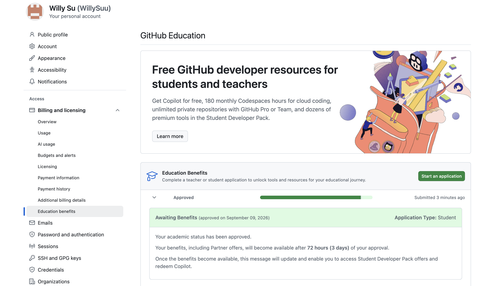

## Positron compared with RStudio

Compared with RStudio, Positron provides an interface that supports multiple programming languages and development tools. Positron supports both R and Python and also includes features such as Data Explorer, version control, and integrated AI assistance. One feature that I really like about Positron is that instead of switching between different applications, I can work with code, data, notebooks, and AI assistance in the same workspace. RStudio has a simple and familiar interface; on the other hand, Positron feels more flexible, especially when working with different programming languages and AI-assisted coding.

## AI inside Positron

There are several ways to use AI inside Positron. One way is to use Positron Assistant to ask questions and generate codes. Another way is to use inline code suggestions, which can suggest code while I am typing. Positron also demonstrates DataBot, which can help explore data by generating and running R or Python code, analyzing the results, and suggesting additional steps. Positron can also connect to different AI models or providers.

## AI Tools I Installed - ChatGPT

I have set up ChatGPT and Gemini as my main AI tools. I use them for explaining concepts, summarizing information, and helping me understand difficult topics. For example, when I have a question about an assignment or a concept that I do not fully understand, I can ask ChatGPT or Gemini to explain it in a simpler way or provide examples. I also find these tools useful when working with R and data analysis because they can help me understand errors, suggest different approaches, and explain the results of my analysis.

## GitHub Copilot

After trying it, I found that it can provide code suggestions while I am working, which can save time. I also like that I can describe what I want to do and receive suggestions based on my code. However, like many AI tools, sometimes the suggestions may not be exactly what I need, so I still need to read the code and check whether it is correct. Overall, I think GitHub Copilot is a useful tool for me because it helps me work more efficiently while also giving me an opportunity to learn different ways to write code.

